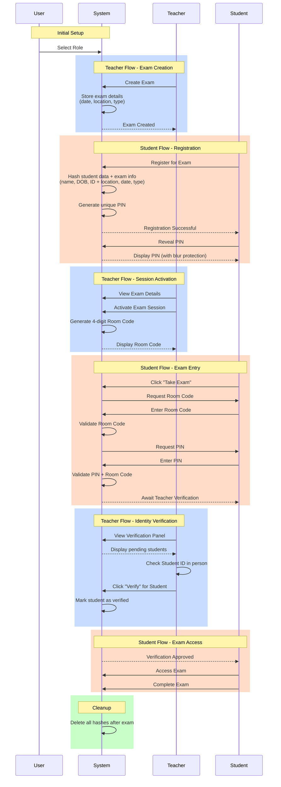
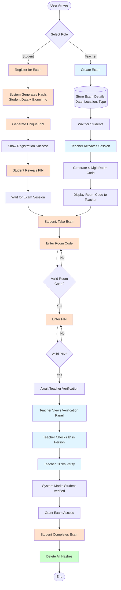
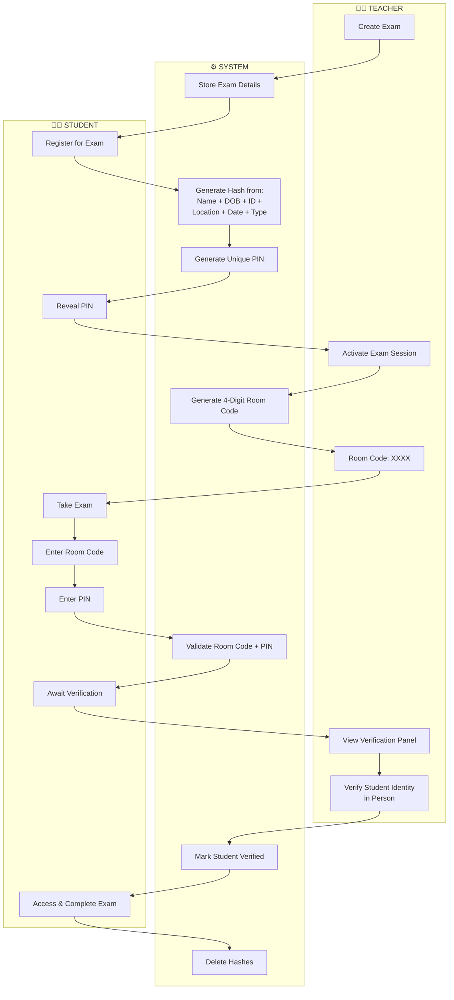

# Exam Login Process Flow

## Mermaid Sequence Diagram



## BPMN-Style Flowchart



## Swimlane Diagram



## ASCII Flow Diagram

```
┌─────────────────────────────────────────────────────────────────────────────┐
│                           EXAM LOGIN PROCESS FLOW                            │
└─────────────────────────────────────────────────────────────────────────────┘

                              ┌──────────────┐
                              │ User Arrives │
                              └──────┬───────┘
                                     │
                              ┌──────▼───────┐
                              │ Select Role  │
                              └──┬───────┬───┘
                   ┌─────────────┘       └─────────────┐
                   │                                   │
        ┌──────────▼───────────┐           ┌──────────▼──────────┐
        │    TEACHER FLOW      │           │   STUDENT FLOW      │
        └──────────────────────┘           └─────────────────────┘

   ╔════════════════════════╗         ╔═══════════════════════╗
   ║  1. CREATE EXAM        ║         ║  3. REGISTER FOR EXAM ║
   ╚═══════════╤════════════╝         ╚═══════════╤═══════════╝
               │                                  │
               │  • Set Date                      │  • Enter Name
               │  • Set Location                  │  • Enter DOB
               │  • Set Exam Type                 │  • Enter Student ID
               │                                  │
               ▼                                  ▼
   ┌───────────────────────┐         ┌──────────────────────────┐
   │ System Stores Exam    │         │ System Generates Hash:   │
   │ Details               │         │ Hash(Name + DOB + ID +   │
   └───────────┬───────────┘         │ Location + Date + Type)  │
               │                      └────────────┬─────────────┘
               │                                   │
               │  2. Exam Created ✓                │
               │                                   ▼
               │                      ┌──────────────────────────┐
               │                      │ Generate Unique PIN      │
               │                      └────────────┬─────────────┘
               │                                   │
               │                                   │  4. Show Success ✓
               │                                   │
               │                      ┌────────────▼─────────────┐
               │                      │ Student Reveals PIN      │
               │                      │ (with blur protection)   │
               │                      └────────────┬─────────────┘
               │                                   │
   ╔═══════════▼════════════╗                     │
   ║  5. ACTIVATE SESSION   ║                     │
   ╚═══════════╤════════════╝                     │
               │                                   │
               │  • Click Activate                 │
               │                                   │
               ▼                                   │
   ┌───────────────────────┐                     │
   │ Generate 4-Digit      │                     │
   │ Room Code             │                     │
   └───────────┬───────────┘                     │
               │                                   │
               │  Display: XXXX                    │
               │                                   │
               │                      ╔════════════▼═══════════╗
               │                      ║  6. TAKE EXAM          ║
               │                      ╚════════════╤═══════════╝
               │                                   │
               │                      ┌────────────▼─────────────┐
               │                      │ Enter Room Code: ____    │
               │                      └────────────┬─────────────┘
               │                                   │
               │                      ┌────────────▼─────────────┐
               │                      │ Validate Room Code       │
               │                      └────────────┬─────────────┘
               │                                   │ Valid? ✓
               │                                   │
               │                      ┌────────────▼─────────────┐
               │                      │ Enter PIN: ______        │
               │                      └────────────┬─────────────┘
               │                                   │
               │                      ┌────────────▼─────────────┐
               │                      │ Validate PIN             │
               │                      └────────────┬─────────────┘
               │                                   │ Valid? ✓
               │                                   │
               │                      ┌────────────▼─────────────┐
               │                      │ Status: Awaiting         │
               │                      │ Teacher Verification     │
               │                      └────────────┬─────────────┘
               │                                   │
   ╔═══════════▼════════════╗                     │
   ║  7. VERIFY IDENTITY    ║                     │
   ╚═══════════╤════════════╝                     │
               │                                   │
               │  • View Verification Panel        │
               │  • See Pending Students           │
               │  • Check ID in Person             │
               │  • Click "Verify"                 │
               │                                   │
               ▼                                   │
   ┌───────────────────────┐                     │
   │ System Marks Student  │                     │
   │ as Verified           │                     │
   └───────────┬───────────┘                     │
               │                                   │
               └──────────────┬────────────────────┘
                              │
                 ┌────────────▼─────────────┐
                 │ Grant Exam Access        │
                 └────────────┬─────────────┘
                              │
                 ╔════════════▼═════════════╗
                 ║  8. COMPLETE EXAM        ║
                 ╚════════════╤═════════════╝
                              │
                 ┌────────────▼─────────────┐
                 │ Student Completes Exam   │
                 └────────────┬─────────────┘
                              │
                 ┌────────────▼─────────────┐
                 │ System Deletes All       │
                 │ Hashes (Privacy)         │
                 └────────────┬─────────────┘
                              │
                         ┌────▼────┐
                         │   END   │
                         └─────────┘

╔════════════════════════════════════════════════════════════════════════╗
║  SECURITY LAYERS                                                       ║
╠════════════════════════════════════════════════════════════════════════╣
║  ✓ Room Code Validation - Prevents wrong classroom access             ║
║  ✓ PIN Authentication - Validates student identity via hash           ║
║  ✓ Teacher Verification - In-person ID check prevents impersonation   ║
║  ✓ Time Window (Production) - Access only during exam periods         ║
║  ✓ Privacy Protection - All hashes deleted after exam completion      ║
╚════════════════════════════════════════════════════════════════════════╝
```

## Key Process Points

### Security Hash Generation
```
PIN = Hash(
    Student.Name + 
    Student.DateOfBirth + 
    Student.ID + 
    Exam.Location + 
    Exam.Date + 
    Exam.Type
)
```

### Authentication Flow
1. **Room Code** → Validates correct physical location
2. **PIN** → Validates student identity
3. **Teacher Verification** → Confirms in-person identity
4. **Time Window** (Production) → Validates exam timing

### Role Switching (Demo Feature)
Users can switch between Teacher and Student roles to experience both workflows.

---

**Note**: This is a click prototype demonstrating the concept. In production:
- Time window validation would be enforced
- Additional security measures would be implemented
- Integration with existing student information systems
- Audit logging for all authentication events

